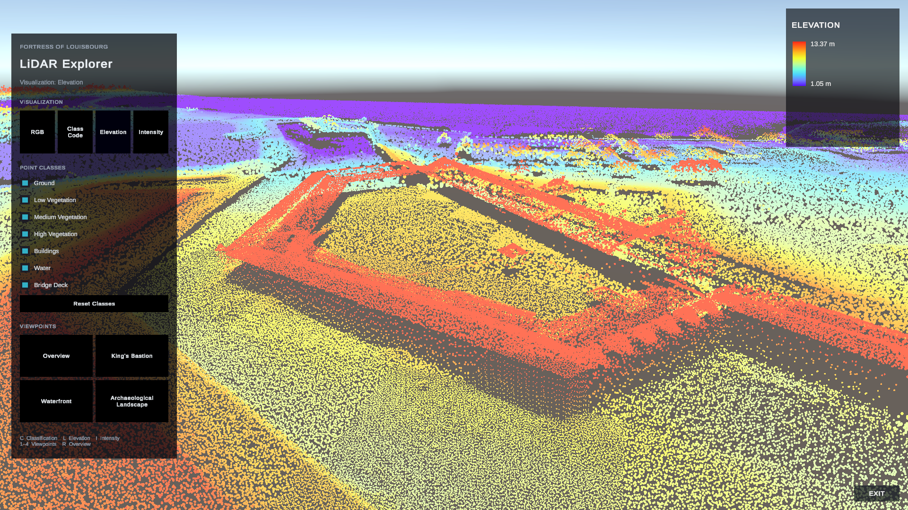
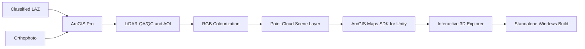
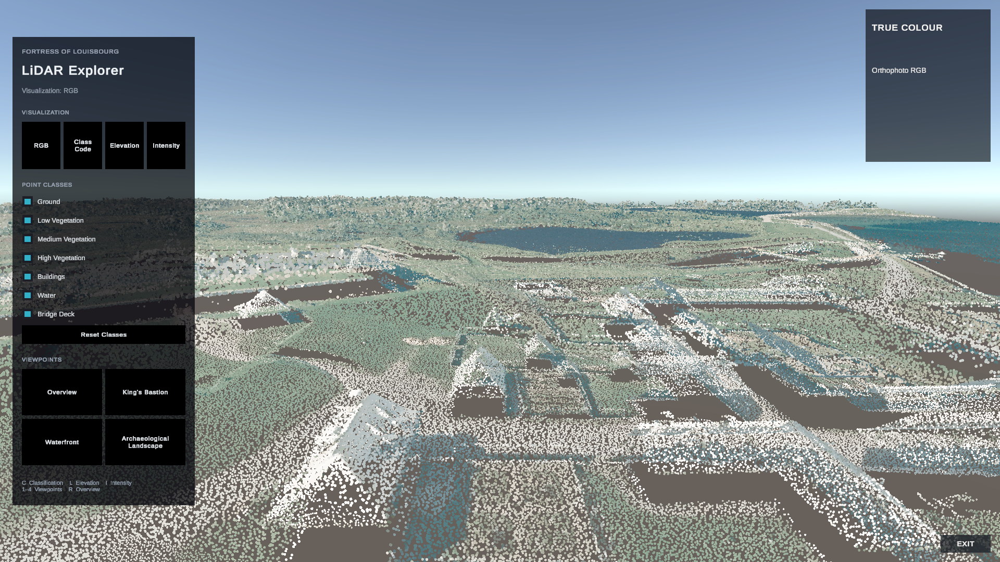
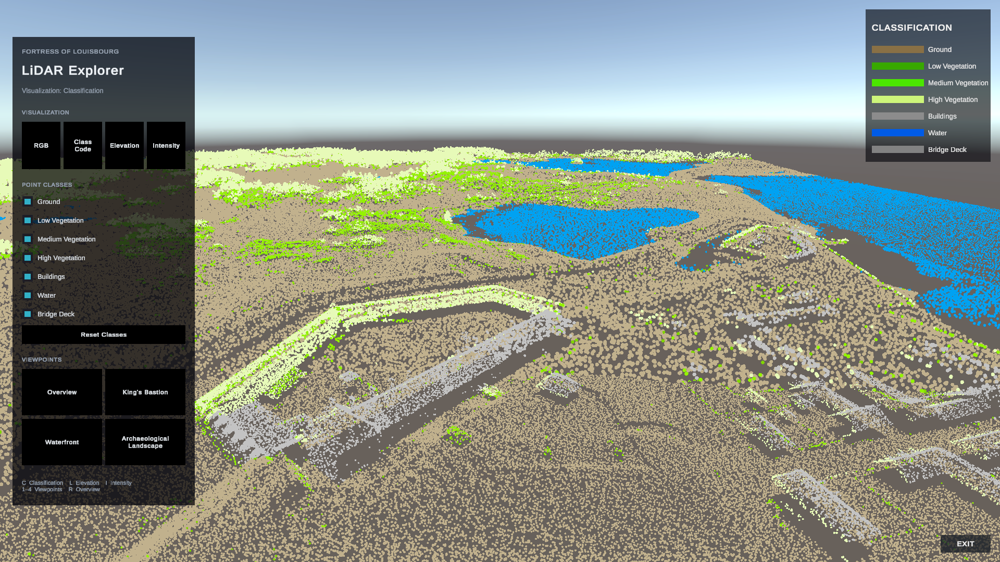
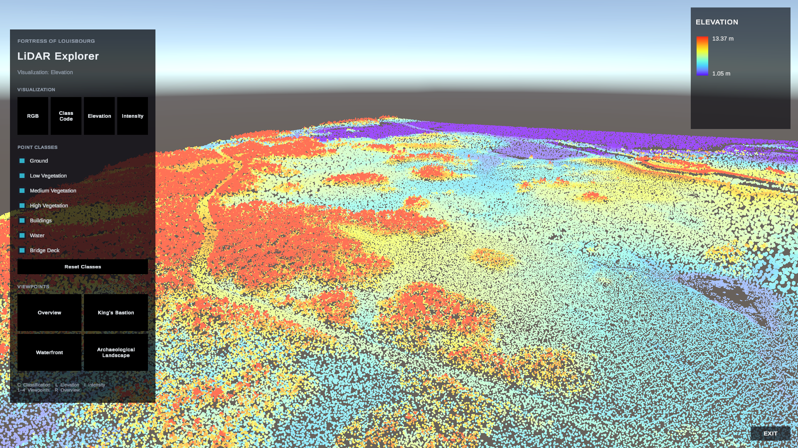
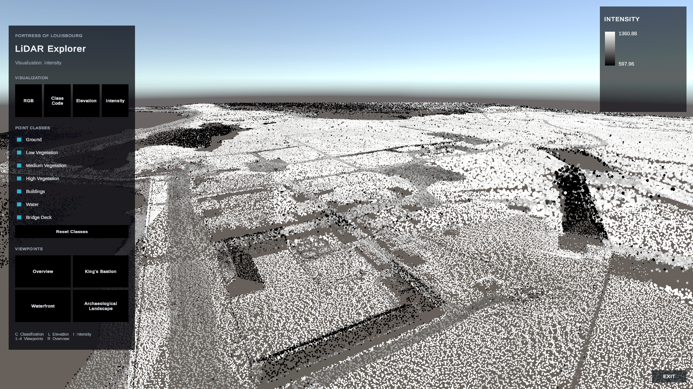

# Fortress of Louisbourg LiDAR Explorer

An interactive 3D LiDAR exploration application for the **Fortress of Louisbourg National Historic Site, Nova Scotia**, built with **ArcGIS Pro** and the **ArcGIS Maps SDK for Unity**.



The project takes a large classified LiDAR dataset through GIS preparation, RGB colourization, point cloud scene layer packaging, and deployment into a standalone Unity application with multiple visualization modes, point class filtering, predefined viewpoints, and dynamic legends.

## Download

A packaged **Windows 64-bit build** is available from the project's latest GitHub Release.

**[Download the latest Windows build](RELEASE_URL_HERE)**

The release includes the processed point cloud scene layer required by the application. Unity and ArcGIS Pro are not required to run the packaged build.

## Project Highlights

- Processed approximately **239 million LiDAR points** across the project area.
- Prepared and QA/QC'd classified LAS/LAZ data in **ArcGIS Pro**.
- Applied orthophoto-derived **RGB colourization** to the LiDAR point cloud.
- Packaged the final point cloud as an **I3S/SLPK point cloud scene layer**.
- Integrated the scene layer into Unity using the **ArcGIS Maps SDK for Unity**.
- Implemented four visualization modes:
  - **RGB / true colour**
  - **Classification**
  - **Elevation**
  - **Intensity**
- Added interactive point class filtering, predefined viewpoints, transition effects, and a visualization-aware dynamic legend.
- Produced a portable Windows build that carries its point cloud data with the application.

## Workflow



The GIS-to-Unity workflow was designed as a single pipeline rather than as separate visualization exercises. ArcGIS Pro handled spatial preparation and scene layer generation, while Unity provided the interactive exploration environment.

## Visualization Modes

### RGB

Displays the orthophoto-derived colour values stored with the point cloud for a more intuitive representation of the site.

### Classification

Visualizes LAS classification values as discrete categories for interpreting the physical structure of the landscape.

### Elevation

Uses a continuous colour ramp to visualize elevation differences across the site.

### Intensity

Uses a grayscale stretch to visualize LiDAR return intensity.

The public source samples in this repository demonstrate the renderer configuration for each of these modes.

## Application Features

- Runtime switching between RGB, classification, elevation, and intensity visualization
- Interactive filtering of point cloud classes
- Resettable class visibility
- Predefined site viewpoints
- Smooth visual transitions between renderer, filter, and viewpoint changes
- Dynamic legend content that follows the active visualization mode
- Self-contained point cloud delivery in the standalone build
- Keyboard and UI controls for common actions

## Technology

**GIS**
- ArcGIS Pro
- LAS/LAZ point cloud workflows
- I3S / Scene Layer Packages (SLPK)
- Spatial reference handling and QA/QC
- Orthophoto LAS colourization

**Application Development**
- Unity
- ArcGIS Maps SDK for Unity
- C#
- Unity UI / TextMesh Pro
- Unity Input System
- Shader Graph and captured frame transitions

## Public Source Samples

The public repository includes selected C# renderer implementations:

```text
unity/LouisbourgExplorer/Assets/Scripts/
├── ClassificationRenderer.cs
├── ElevationRenderer.cs
├── IntensityRenderer.cs
└── RGBRenderer.cs
```

These files demonstrate how the application configures ArcGIS point cloud rendering for categorical, continuous, and RGB attributes.

The full application also contains additional runtime systems for point cloud lifecycle management, persistent filtering, transition coordination, UI generation, and viewpoint control. 

## Data and Repository Scope

The raw and processed geospatial datasets are intentionally excluded from Git because of their size and because the repository is intended as a presentation rather than a data distribution package.

Development data included:

- classified LAZ point cloud tiles
- orthophoto imagery
- processed LAS datasets
- derived scene layer content
- the final SLPK used by the standalone application

Source and provenance information is documented in [`references/sources.md`](references/sources.md).

## Media

### RGB Overview



### Classification



### Elevation



### Intensity


<!--
### Demo

[Watch the project demo](VIDEO_URL_HERE)
-->

## Repository Structure

```text
.
├── outputs/
│   └── screenshots/
├── references/
│   └── sources.md
└── unity/
    └── LouisbourgExplorer/
        └── Assets/
            └── Scripts/
                ├── ClassificationRenderer.cs
                ├── ElevationRenderer.cs
                ├── IntensityRenderer.cs
                └── RGBRenderer.cs
```

## Project Status

**Complete — v1.0.0**

The application has been tested as a standalone Windows build with the development data drive disconnected, confirming that the release package is self-contained.

## License

See [`LICENSE`](LICENSE) for repository licensing information.
